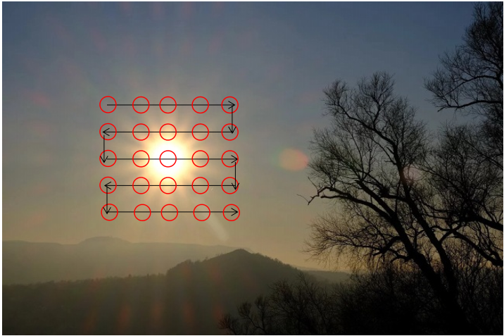
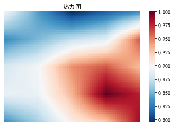

# solar_imaging_with_SMT

暂时没有什么界面，以后有时间也许会把这个代码做出界面，方便操作，不过可以直接操作的软件在QQ群926020514群文件中有。在此我只是写了包括自己一点思路的python代码，见于文末压缩包附件，里面同时也包含了一些观测数据。

建议先阅读http://radioastronomy.online/home/topic/50/ ，里面有该代码效果和具体的观测介绍

这个代码默认是处理由Sdrsharp的IF average导出的数据，关于Sdrsharp和IF average插件可以见于论坛的帖子或者上网搜索。

具体的注释我都写在了代码中，扫描方式也见于http://radioastronomy.online/home/topic/50/ ，按照该文的扫描方式，依次把导出的数据从1开始按数字命名，比如1,2,3,4,5......，具体可参考附件里的数据。

主要调节的参数就是沿着x方向和沿着y方向的扫描点数，即x_num，y_num。插值次数inter_num我默认调到了3，如果不想插值的话，可以改为0

 

注1：Data文件夹观测太阳的数据可能并不准确，因为当时观测太阳时，氢谱线也在附近，所以数据里面在1420MHz附近明显有峰突起。

注2：如果读者使用rtl sdr观测的话，可以先在IF Average插件中扣除凹凸不平的底噪。当然，不扣除应该也可以得到正确的成像，在此我只是提示一下有这个操作，也许哪天能用得到，可以参考http://radioastronomy.online/home/topic/15/ 红字部分所示

一些图片如下所示，第一张是扫描方式，第二张是效果不好的成像

